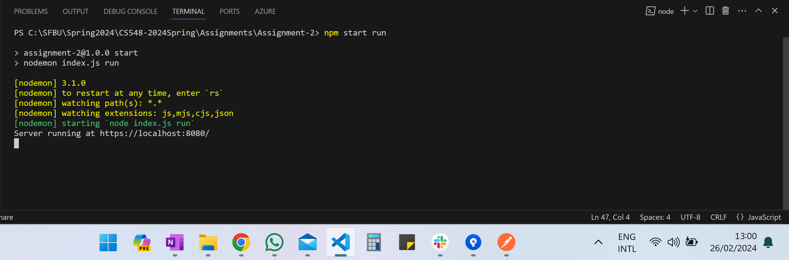
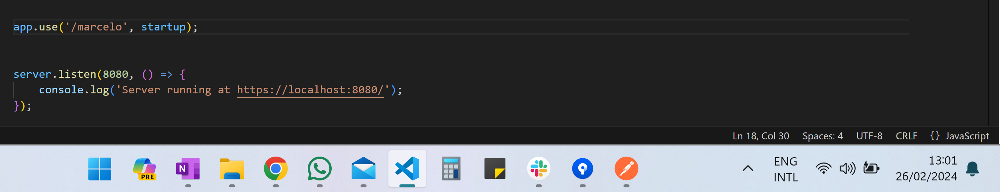
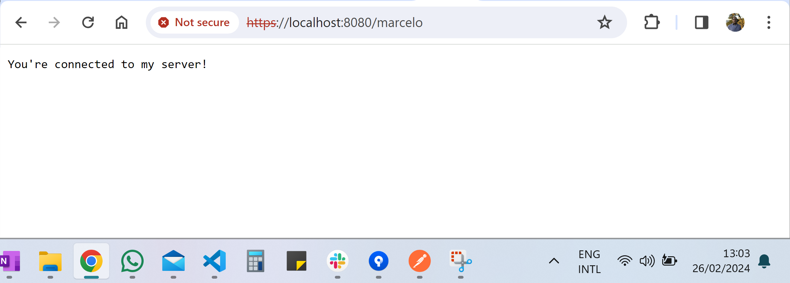
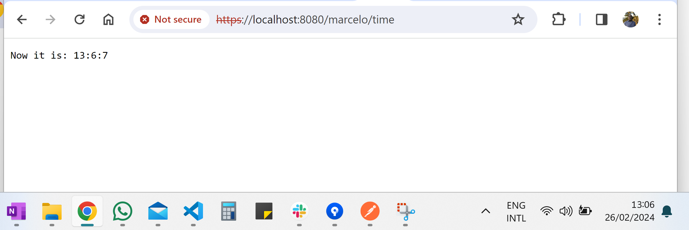
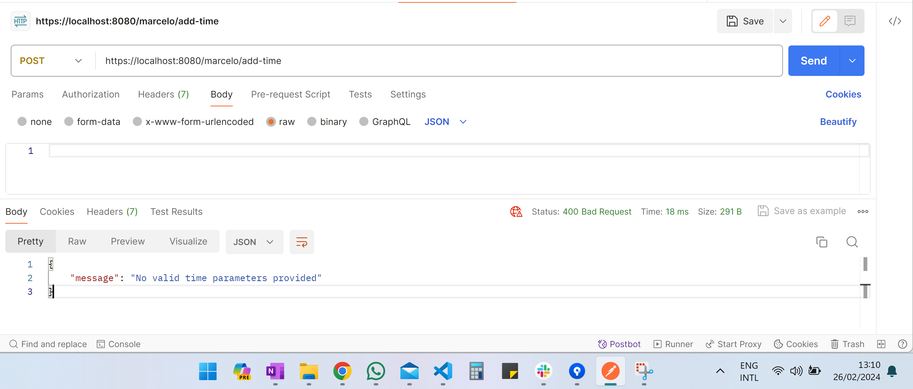
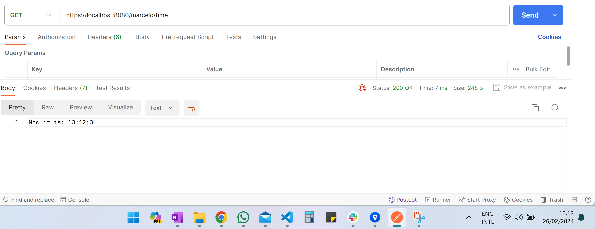
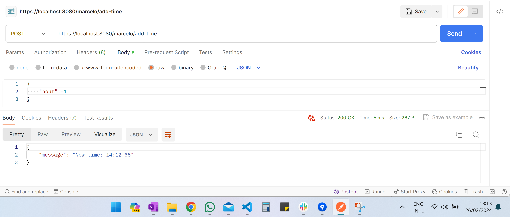

# Assingment 2

**Description:** 
Attach the screen recording and your code (GitHub link) with HTTPS working. Create one GET or POST request.
The web service must be in HTTPS.
The SSL creation should be based on the lecture standard.
If you are not able to add the screen recording then attach the screenshot which should show that it is your personal laptop.

## Running Server
- Terminal



- Route set to run as https://localhot:8080/marcelo


- Browser:


## GET
Create a GET that shows the current time. Accessed by the route: “/marcelo/time”:
```
    startup.get('/time', (req, res) => {
        res.status(200);
        res.setHeader('Content-Type', 'text/plain');
    
        var now = new Date();
        // Get the current hour, minute, and second
        var currentHour = now.getHours();
        var currentMinute = now.getMinutes();
        var currentSecond = now.getSeconds();
        var currentTime = currentHour + ":" + currentMinute + ":" + currentSecond;
        res.send("Now it is: " + currentTime);
    });
```

**Result:**



## POST
Created a POST that adds time (hour, minutes, or second) to the current time. Accessed by the route: “/marcelo/add-time”

```
    startup.post('/add-time', (req, res) => {
        var now = new Date();
    
        if (req.body && (req.body.hour || req.body.minute || req.body.second)) {
    
            hoursToAdd = req.body.hour || 0;
            minutesToAdd = req.body.minute || 0;
            secondsToAdd = req.body.second || 0;
    
            now.setHours(now.getHours() + hoursToAdd);
            now.setMinutes(now.getMinutes() + minutesToAdd);
            now.setSeconds(now.getSeconds() + secondsToAdd);
    
            var newTime =
            now.getHours() + ":" +
            now.getMinutes() + ":" +
            now.getSeconds();
    
            res.status(200);
            res.json({ message: `New time: ${newTime}` });
        } else {
            res.status(400).json({ message: `No valid time parameters provided` });
        }
    });
```

- **Result 1**
Request without sending body:



- **Result 2**
Adding 1 hour.
    I am going to show the current time to compare the POST result:
    - Current time:


    - POST result:


