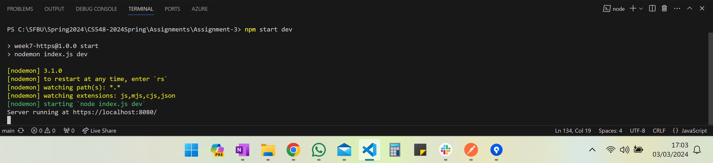
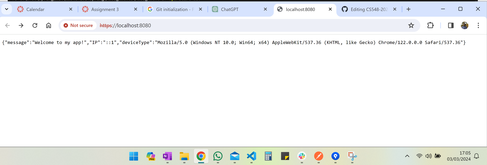
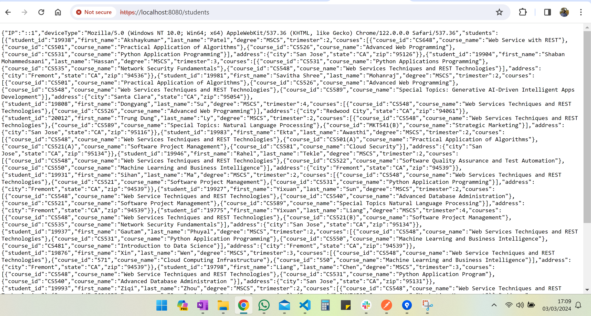
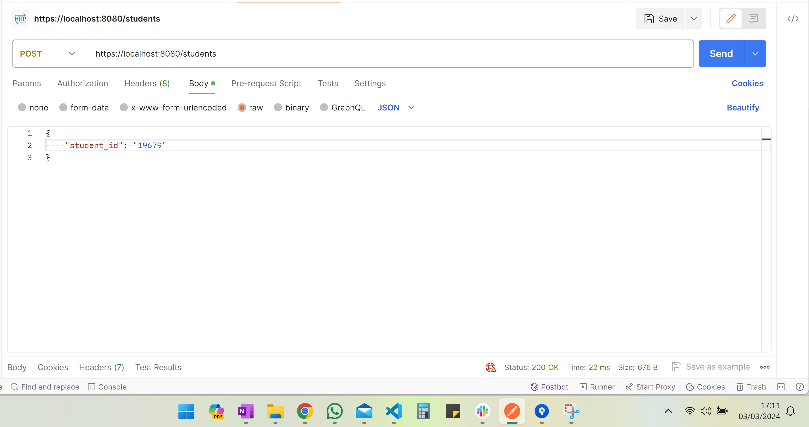
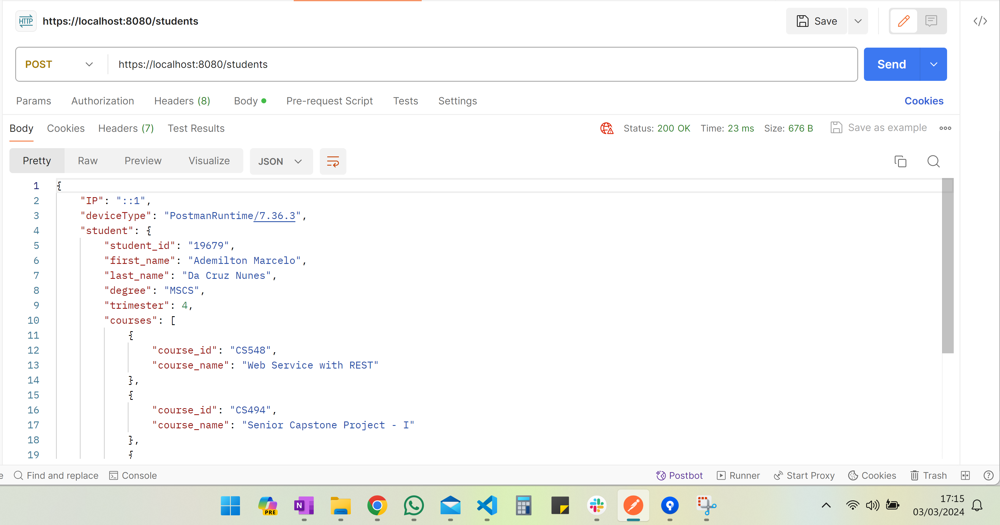
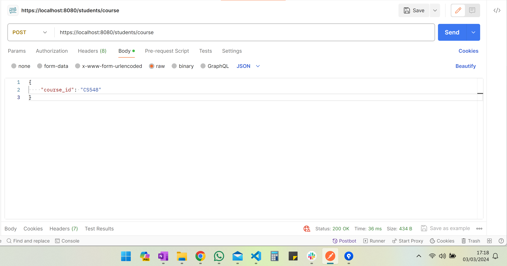
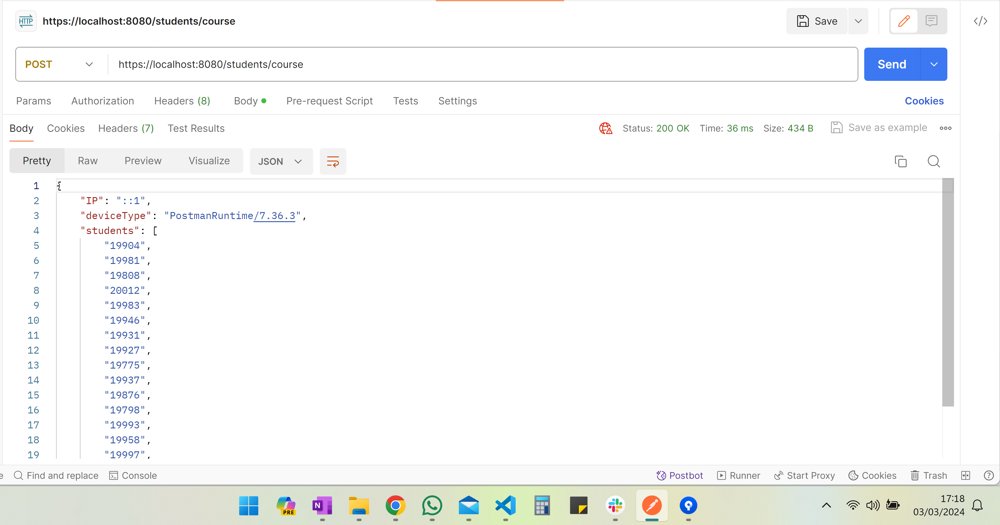
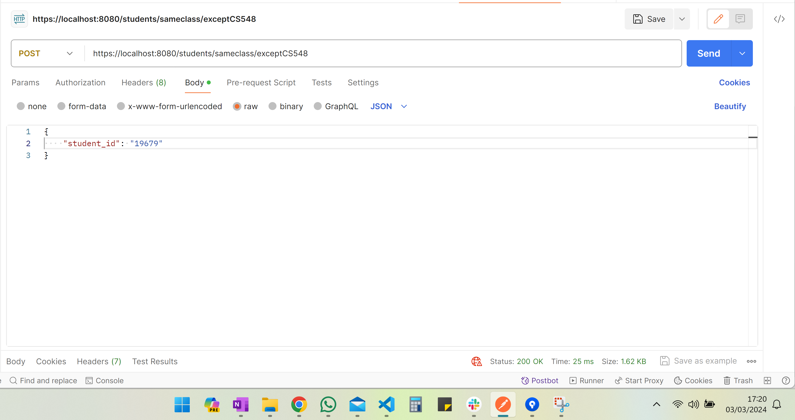
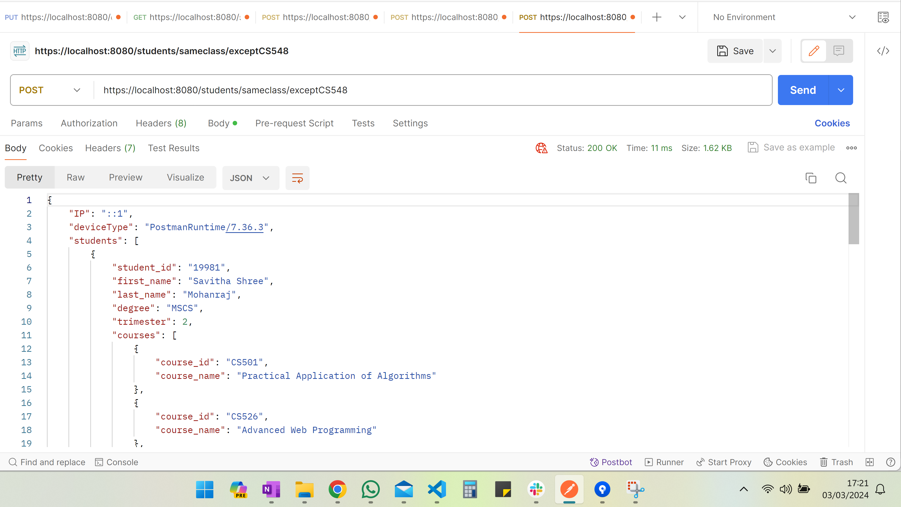

# Assignment 3

## Report
It is the report of the assignment 3.
## Create a HTTPS Server
I created the server in the route https://localhot:8080.
I put it to show the device type and IP address:

- Terminal

- Browser:

## Create a routes for:

### GET  / to retrieve all the student-info
- I create the route https://localhost:8080/students
- It shows the device name and IP address in the beginning of JSON

**Result:**

### POST /to retrieve your information based on 'student-id'
- I am using the same route https://localhost:8080/students, but this is a POST so I need to inform the student id

- **Request**
Request sending student-id:

- **Result**
I tested sending my student ID:

### POST /to retrieve student's info who has taken CS548 -> the result should be all students ( return student-id only)
- I am using the same route https://localhost:8080/students/course

- **Request**
Request sending course-id:

- **Result**
I tested sending my the Course ID CS548:

### POST /to retrieve who has taken the courses you have taken except CS548.
- I am using the same route https://localhost:8080/students/sameclass/exceptCS548

- **Request**
Request sending student-id:

- **Result**
I tested sending my student id:

