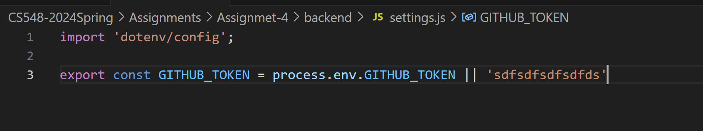

# Assignment 4

## Report
It is the report of the Assignment 4.

## Create a simple configuration file in GitHub in JSON format
I created an new and private repository on Github with a JSON File.
You can see the file created clicking in [Here](./github_settings_example/github_settings.json)
This file list the Safeway stores with some settings from those stores and also which zipcodes they map.

## Create a new HTTPS web service.
The webservice is stored in the folder backend [Here](./backend)

### Created a github token to access json file.
I created and configurated Upstream API to access the json File. In order to do it, I created:
- Setting to access the github token, the key itself is stored in the **.env file**

### Call the API/JSON file from Github.
- Besides calling the API using axious, I had to include in the header some information like github token.

- Getting github file response

### Create a new POST request
- I created a POST that filter the Stores by ZipCode, having to send zipcodes in the body of requisition.

- Response of POST Request

### Create your own logFormat for logger.
- I created the logger to include in the system, besides datetime and level and message, I include the IP Address:

- Result of Logger

## Create a new React application.
The frontend in React is stored in the folder frontend [Here](./frontend)

